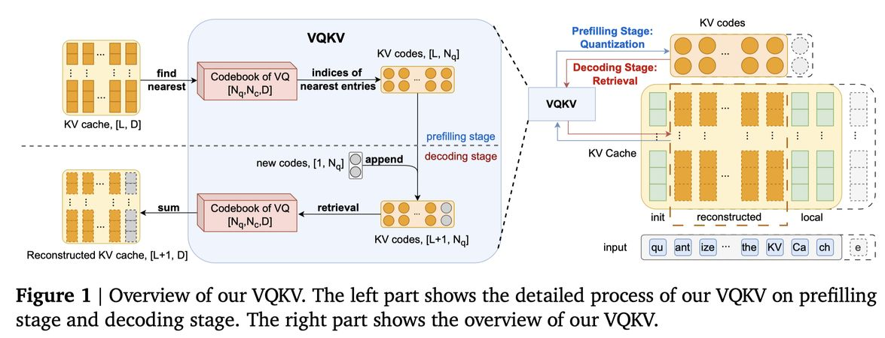

# VQKV: High-Fidelity and High-Ratio Cache Compression via Vector-Quantization

> Yixuan Wang, Qingyu Shi, Jiayu Zhou, Dianbo Liu, Ziwei He, Zhouhan Lin

> 注：以下论文笔记由 AI Agent 自动生成，可能存在理解偏差或遗漏，请以原论文为准。

## Abstract

The growing context length of Large Language Models (LLMs) enlarges the Key-Value (KV) cache, limiting deployment in resource-limited environments. Prior training-free approaches for KV cache compression typically rely on low-rank approximation or scalar quantization, which fail to simultaneously achieve high compression ratios and high reconstruction fidelity. We propose VQKV, a novel, training-free method introducing vector quantization (VQ) to obtain highly compressed KV representations while preserving high model fidelity, allowing for the representation of thousands of floating-point values with just a few integer indices. As a result, VQKV achieves an 82.8% compression ratio on LLaMA3.1-8B while retaining 98.6% of the baseline performance on LongBench and enabling 4.3× longer generation length on the same memory footprint.

## 一句话总结

VQKV 是一种基于向量量化（VQ）的无训练 KV 缓存压缩方法，通过将高维缓存向量映射到紧凑码本并存储整数索引，实现 82.8% 的压缩率同时保留 98.6% 的基线性能，使相同内存下的生成长度延长 4.3 倍。

## 背景与问题

- **KV 缓存瓶颈**：随着上下文长度增长，KV 缓存占用大量内存，限制了在资源受限环境中的部署。
- **现有方法的局限**：
  - **Token 剪枝**（SnapKV, H2O）：可实现高压缩率，但不可逆信息丢失
  - **特征维度缩减**（MLA, ASVD）：需要额外训练，或在高压缩率下牺牲保真度
  - **标量量化**（KIVI, Quant）：独立量化每个值，无法利用向量间的相关性
- **核心问题**：如何在**无训练**条件下，同时实现**高压缩率**和**高保真度**？

## 核心方法

### 1. 向量量化（VQ）基础

向量量化（Vector Quantization）通过将高维向量映射到紧凑的码本（codebook）中，用少量整数索引表示数千个浮点值，实现极端压缩。

**关键挑战**：
- LLM 对 KV 缓存值高度敏感，即使微小扰动也会导致性能显著下降
- RoPE（旋转位置编码）引入异质频率特性，使 Key 缓存的表示结构差异大，难以准确重建

### 2. VQKV 方法

VQKV 使用**残差简单向量量化（RSimVQ）**压缩 KV 缓存：

**核心机制**：
1. **多码本残差量化**：每个码本表示原始缓存的一个独立子空间
2. **投影矩阵**：每个码本有额外的投影矩阵，增强表示能力
3. **残差传递**：每次量化后，将残差传递到下一个码本

**形式化表示**：
- 输入：KV 向量 x ∈ R^D
- 输出：整数索引 z₁, ..., z_N（每个索引 ≤ S，S 为码本大小）
- 压缩：原 [L, D] 浮点数 → [L, N] 整数（N << D）
- 重建：遍历码本，求和所有检索到的条目

**训练损失**：
L = ||x - x̂||² + β||q_z - sg(x)||² + γ||x - sg(q_z)||

其中 sg(·) 为停止梯度操作。

### 3. 推理流程

**预填充阶段（Prefilling）**：
1. 保留初始段（L_init）和最近段（L_local）不压缩
2. 中间段 KV 缓存通过码本压缩为 KV codes
3. 每个缓存向量找到码本中最近的条目，记录索引

**解码阶段（Decoding）**：
1. 压缩新 token 的缓存，更新存储的 KV codes
2. 维护局部滑动窗口（丢弃最旧条目）
3. 按需从码本重建 KV 缓存

### 4. 与现有方法的对比

| 方法 | 训练需求 | 压缩方式 | 保真度 | 压缩率 |
|------|----------|----------|--------|--------|
| Token 剪枝 | 无训练 | Token 删除 | 不可逆损失 | 高 |
| 特征维度缩减 | 需训练 | 低秩分解 | 依赖训练 | 中等 |
| 标量量化 | 无训练 | 独立量化 | 低 | 中等 |
| **VQKV** | **无训练** | **向量量化** | **高** | **高** |

## 技术细节

### 码本训练

- **数据**：约 10M tokens 的 KV 缓存向量
- **训练方式**：Key 和 Value 缓存分别训练两套码本
- **优化**：使用停止梯度操作保持梯度流
- **码本结构**：多个残差连接的码本，每个码本有投影矩阵

### 压缩配置

- **码本大小**：S（每个码本的条目数）
- **码本数量**：N（残差量化迭代次数）
- **压缩比**：D × L → N × L（D=原始维度，N=码本数量）
- **示例**：D=128, N=4, S=1024 → 128×2 bytes → 4×10 bits ≈ 96.9% 压缩

### 评估基准

- **模型**：LLaMA3.1-8B
- **基准**：LongBench（21 个子集）
- **指标**：性能保留率、生成长度

## 主要结果

### 压缩效果

- **压缩率**：82.8%（LLaMA3.1-8B）
- **性能保留**：98.6%（LongBench）
- **生成长度**：4.3× 更长（相同内存）

### 关键发现

1. **高保真度**：VQKV 在某些任务上甚至超过未压缩的全缓存基线
2. **高效重建**：通过残差量化，逐步精化表示，实现高保真度重建
3. **RoPE 鲁棒性**：残差设计有效分散 RoPE 引入的变化
4. **内存效率**：相同硬件设置下，生成长度延长 4.3 倍

## 优点与局限

### 优点

1. **无训练**：不修改模型参数，可直接部署到不同模型和检查点
2. **高压缩率**：82.8% 压缩率，显著减少内存占用
3. **高保真度**：98.6% 性能保留，某些任务甚至超过基线
4. **向量量化**：利用向量间相关性，避免标量量化的独立性问题
5. **残差设计**：有效处理 RoPE 引入的异质频率特性
6. **内存效率**：相同内存下生成长度延长 4.3 倍

### 局限

1. **码本训练**：需要约 10M tokens 的 KV 缓存向量来训练码本，有一定开销
2. **码本存储**：码本本身需要额外存储（虽然比全缓存小得多）
3. **重建延迟**：按需重建 KV 缓存可能引入额外延迟
4. **模型特定**：码本需针对特定模型训练，可能不通用
5. **评估范围**：仅在 LLaMA3.1-8B 和 LongBench 上验证，其他模型和基准需进一步测试

## 与 EfficientPaper 主题的关系

VQKV 属于 **KV Cache 量化**（`kv_cache_quant`）和 **KV Cache 稀疏**（`kv_cache_sparse`）领域，核心贡献包括：

- **向量量化**：将 VQ 引入 KV 缓存压缩，实现高保真度高压缩率
- **无训练方法**：不修改模型参数，可直接部署
- **残差设计**：处理 RoPE 引入的异质频率特性

与 EfficientPaper 中已有论文的关系：
- **KIVI**（2024）：标量量化方法，VQKV 的基线之一
- **KunServe**（2024）：KV 缓存压缩方法
- **KVServe**（2025）：KV 缓存服务方法
- **MLA**（2024）：特征维度缩减方法，需要额外训练
- **H2O**（2023）：Token 剪枝方法，不可逆信息丢失

## 可复现/实现要点

1. **码本训练**：约 10M tokens 的 KV 缓存向量，Key 和 Value 分别训练
2. **RSimVQ**：多个残差连接的码本，每个码本有投影矩阵
3. **推理流程**：预填充阶段压缩，解码阶段按需重建
4. **参数配置**：码本大小 S，码本数量 N，维度 D
5. **开源**：https://github.com/LUMIA-Group/VQKV

## 个人备注

- VQKV 的核心洞察是：**向量量化可以同时实现高压缩率和高保真度**，这是标量量化和 token 剪枝无法做到的。
- 残差设计（RSimVQ）是关键技术，它通过逐步精化表示来处理 RoPE 引入的异质频率特性。
- VQKV 是无训练方法，这使得它可以立即部署到不同模型和检查点，具有很好的实用性。
- 82.8% 的压缩率和 98.6% 的性能保留率是非常有吸引力的结果。
- 论文来自上海交通大学、上海人工智能实验室等，且代码开源，说明这是一个工程友好的方法。
- 值得关注的未来方向：(1) 在更大模型上的验证；(2) 与其他 KV 缓存压缩方法的结合；(3) 端到端训练的 VQ 方法。
