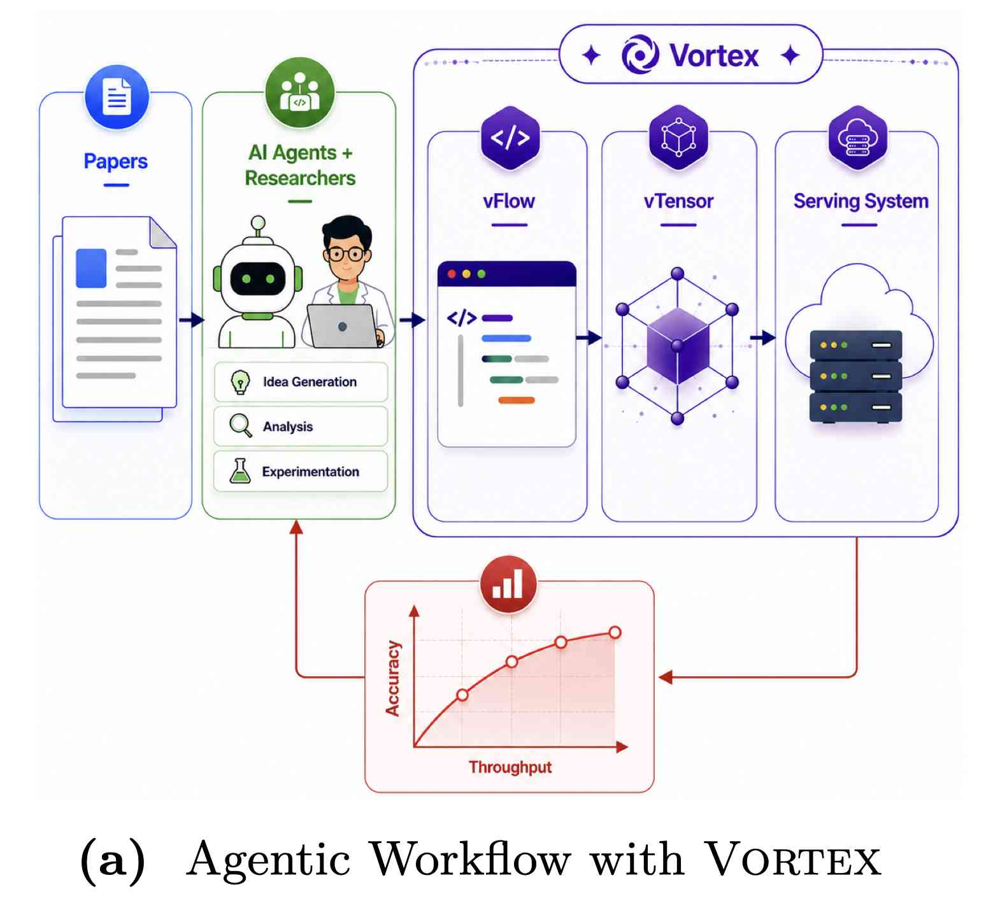

# Vortex: Efficient and Programmable Sparse Attention Serving for AI Agents

> **本笔记由 AI Agent 自动生成，基于论文全文阅读与分析。生成时间：2026-06-05。**

## 一句话总结

Vortex 提出了一种可编程的稀疏注意力服务系统，通过 Python 嵌入式前端语言 vFlow 和页面中心张量抽象 vTensor，实现了稀疏注意力算法的快速原型设计和高效部署，AI 代理可自动生成优化的稀疏注意力算法，最高达到 3.46× 的吞吐量提升。

## 摘要翻译

稀疏注意力对于服务大语言模型（LLM）变得越来越重要，因为生成长度不断增长。然而，大规模部署和评估新的稀疏注意力算法仍然高度工程密集，阻碍了人类研究者和 AI 代理探索稀疏注意力设计。为了解决这一挑战，我们提出了 Vortex，一个结合 Python 嵌入式前端语言和页面中心张量抽象的系统，用于表达广泛的稀疏注意力算法，并与现代 LLM 服务栈紧密集成。Vortex 实现了稀疏注意力算法的快速原型设计、部署和评估，有效地将其理论效率增益转化为实际吞吐量提升。因此，Vortex 显著加速了稀疏注意力算法的设计和迭代。首先，AI 代理使用 Vortex 自动生成和优化多种算法，最好的算法在保持准确性的同时达到 3.46× 的吞吐量提升。其次，Vortex 将稀疏注意力扩展到新兴架构和非常大的模型，在 NVIDIA B200 GPU 上，基于 MLA 的 GLM-4.7-Flash 达到 4.7× 的吞吐量提升，229B 参数的 MiniMax-M2.7 达到 1.37× 的提升。

## 研究动机

### LLM 推理挑战

随着 LLM 生成长度在推理、代理系统和强化学习等应用中不断增长，KV 缓存移动已成为主要系统瓶颈。稀疏注意力正在成为降低推理成本的基础技术。

### 现有方法的局限

1. **难以泛化到动态稀疏性**：现有系统如 FlashInfer 和 FlexAttention 虽然优化了静态稀疏注意力，但无法自然扩展到更准确的动态稀疏注意力。
2. **缺乏可编程性**：现有 LLM 服务系统对新算法的集成支持有限，添加新变体可能需要大量工程工作（例如，在 SGLang 中实现 Double Sparse 需要约 2000 行代码）。
3. **与演化服务系统不兼容**：许多稀疏注意力方法依赖自定义内核，与现代 LLM 服务栈的关键组件（如分页注意力、前缀缓存）不兼容，导致理论加速无法转化为实际端到端增益。

### 核心洞察

- 需要一个框架，让 AI 代理能够通过指定稀疏模式和注意力计算方式来表达稀疏注意力机制，同时抽象低级张量布局和内存管理细节。
- 自然方法是将每种稀疏注意力变体实现为专用自定义操作符，但这缺乏组合性，难以扩展。
- 受稀疏张量线性代数的抽象启发，提出页面中心张量系统 vTensor，使稀疏注意力算法能够以灵活和可组合的方式表达。

## 方法（技术细节）

### 1. vFlow 编程模型

#### 核心设计原则

vFlow 采用单一请求心理模型，将张量视为批量大小为 1，同时暴露灵活和可组合的原语来构建稀疏注意力机制。

#### 两阶段分解

1. **查询无关预处理（forward_cache）**：计算块级键摘要，这些摘要仅依赖于键缓存，可在缓存构建时预计算并在解码步骤间重用。
2. **查询相关执行（forward_indexer）**：为每个传入查询执行动态计算，包括计算块相关性分数、选择 top-k 块、对相应 token 执行注意力。

#### 示例：Block Top-k Attention

```python
class BlockTopK(vFlow):
    def forward_cache(c):
        c["centroids"] = Mean(c["k"], dim=1)
    def forward_indexer(q, c):
        s = GeMM(c["centroids"], q.T)
        i = topK(Mean(s, dim=2), dim=1)
        return attn(q, c["k"], c["v"], i)
```

#### 可表达性

vFlow 可以自然表达多种动态稀疏注意力算法：
- **DoubleSparse**：通过 Gather 和 GeMM 实现
- **BlockTopK_NSA**：使用 Softmax、Conv 和 TopK
- **Quest**：使用 Max、Min 和 TopK
- **H2O**：使用 Softmax、GeMM 和跨步累积

#### 缓存中间结果

vFlow 允许通过在 forward_cache 中显式声明缓存来存储操作符输出，例如 H2O 中的 c["acc"] 累积注意力分数。

#### 扩展到静态稀疏注意力

静态稀疏注意力可以通过构造仅依赖序列位置而非输入内容的索引集来表达。

### 2. vTensor 抽象

#### 张量定义

vTensor 扩展了 PyTorch 张量，带有显式布局信息：

```
xv = (x, C)
```

其中 x 是底层 PyTorch 张量，C 捕获布局元数据，定义为 C = (b, p, I)，b 是批量大小，p 是索引指针数组，I 是索引结构。

#### 操作符定义

vTensor 的操作符通过独立应用于批量中的每个序列来定义。关键特性：
- **组合性**：复杂算法应通过组合少量原始张量操作符构建，而不是依赖高度专门化的整体内核
- **自包含性**：张量操作符的输出应保持直接可被后续操作符消费的格式

#### 与现有系统的兼容性

vTensor 兼容现代 LLM 服务系统的关键组件：
- 分页注意力（Paged Attention）
- 前缀缓存（Prefix Caching）
- 可变序列长度和批处理大小

### 3. 执行后端与优化

#### 程序编译

vFlow 程序被翻译为可执行的 vTensor 操作符，然后在现代服务系统中执行。

#### 关键优化

1. **工作负载规划器**：平衡 GPU 线程块调度
2. **内核融合**：减少中间内存流量
3. **随机优化**：用于 radix top-k，这是稀疏注意力中的关键操作符

#### 与优化的注意力后端兼容

Vortex 兼容现有的优化注意力后端，包括：
- GQA（Grouped Query Attention）
- MLA（Multi-head Latent Attention）

## 实验结果

### 1. AI 代理生成的稀疏注意力

- **一次性设置**：Claude Code 和 Codex 生成多种稀疏注意力算法，最好的算法在保持准确性的同时达到 3.46× 的吞吐量提升
- **18 小时自主优化循环**：自动优化算法，提高吞吐量

### 2. 服务效率

#### 相对于 SGLang 的改进

| 方法 | 吞吐量提升 | P95 延迟降低 |
|------|-----------|-------------|
| Block Top-k | 3.60× | 11.7× |
| Quest | 2.98× | 12.8× |

#### 端到端性能

- 在 NVIDIA H200 SXM 上评估
- 在 32k 上下文长度和 BS=16 时：
  - Block Top-k: 3.78–4.81× 端到端加速（跨 Qwen3 模型大小）
  - Quest: 3.46–4.33× 端到端加速
- 在 16k 上下文长度时：2.08–2.96× 加速
- 在 8k 上下文长度时：1.27–1.74× 加速
- 在小批量（BS=4, 32k）时：1.28–1.81× 加速

#### 内核级性能

- 在 Qwen3-8B 上，BS=16，32k 上下文长度：
  - 稀疏注意力内核：0.025 ms
  - 密集注意力内核：0.760 ms
  - 加速：>30× 内核级

### 3. 扩展到新兴架构

#### GLM-4.7-Flash (MLA-based)

- 在 NVIDIA B200 上，使用 rope-aware 稀疏注意力
- 达到 4.7× 的吞吐量提升

#### MiniMax-M2.7 (229B 参数)

- 在四块 NVIDIA B200 GPU 上服务
- Block Top-k 达到 1.37× 吞吐量提升
- 甚至超过密集注意力准确性

### 4. Radix Top-k 内核优化

- **近似 radix top-k + remap**：在 recall@k > 0.97 时，持续优于 radix top-k 基线
- **加速范围**：1.30–1.62×，平均改进 1.49×
- **稳定性**：在不同 k 值、预填充长度和分数分布（双峰、正态、对数正态、均匀）下保持稳定

## 优势

1. **可编程性**：通过 vFlow 和 vTensor 抽象，用户可以轻松表达和修改稀疏注意力算法
2. **高效执行**：紧密集成到现代 LLM 服务栈，实现高效执行
3. **快速原型设计**：显著加速稀疏注意力算法的设计和迭代
4. **AI 代理集成**：支持 AI 代理自动生成和优化稀疏注意力算法
5. **广泛适用性**：适用于多种稀疏注意力算法，包括动态和静态稀疏性
6. **高性能**：在多种模型和硬件上实现显著的吞吐量提升和延迟降低
7. **可扩展性**：能够扩展到新兴架构和非常大的模型
8. **组合性**：通过组合少量原始操作符构建复杂算法，提高模块性和可扩展性

## 局限

1. **仅关注解码阶段**：当前 Vortex 专注于解码阶段，将预填充阶段留作未来工作
2. **预填充阶段未优化**：虽然在解码阶段表现出色，但预填充阶段的优化未被讨论
3. **硬件依赖**：在 NVIDIA H200 SXM 和 B200 上评估，其他硬件平台的性能未验证
4. **模型大小依赖**：在非常大的模型（如 229B 参数）上，加速比相对较小（1.37×）
5. **动态稀疏性开销**：动态稀疏注意力的计算开销可能超过注意力操作符本身
6. **内存消耗**：虽然减少了计算，但稀疏注意力的内存使用可能增加
7. **与自定义内核的兼容性**：虽然兼容现有后端，但与完全自定义内核的集成可能需要额外工作
8. **评估范围有限**：主要在 Qwen3 模型上评估，其他模型的性能未验证

## 与 EfficientPaper 相关的研究方向

1. **稀疏注意力与 KV 缓存优化**：Vortex 的核心目标是优化 KV 缓存移动，与 EfficientPaper 中的 KV 缓存优化方向高度相关
2. **LLM 服务系统**：Vortex 是一个服务系统，与 EfficientPaper 中的 LLM 服务系统研究方向一致
3. **动态稀疏注意力**：Vortex 支持动态稀疏注意力，这是 EfficientPaper 中一个重要研究方向
4. **可编程性与自动化**：Vortex 通过 vFlow 和 vTensor 提供可编程性，与 EfficientPaper 中的自动化研究方向相关
5. **硬件优化**：Vortex 在现代 GPU（H200、B200）上优化，与 EfficientPaper 中的硬件优化研究方向一致
6. **AI 代理辅助研究**：Vortex 支持 AI 代理自动生成和优化算法，与 EfficientPaper 中的自动化研究方向相关

## 关键技术要点

1. **vFlow 编程模型**：通过 Python 嵌入式前端语言，实现稀疏注意力算法的快速原型设计
2. **vTensor 张量抽象**：页面中心张量系统，支持分页布局和动态稀疏性
3. **两阶段分解**：查询无关预处理和查询相关执行，提高效率
4. **组合性**：通过组合少量原始操作符构建复杂算法
5. **随机优化**：用于 radix top-k，提高 top-k 操作的效率
6. **内核融合**：减少中间内存流量
7. **与现有服务栈集成**：兼容分页注意力、前缀缓存等现代 LLM 服务组件

## 参考文献

- FlashInfer (Ye et al., 2024a)
- FlexAttention (Dong et al., 2024)
- SGLang (Zheng et al., 2023)
- vLLM (Kwon et al., 2023)
- Quest (Tang et al., 2024)
- H2O (Zhang et al., 2023)
- DoubleSparse (Yang et al., 2024b)
- DeepSeek (Liu et al., 2025; Yuan et al., 2025; DeepSeek-AI, 2026)
- GLM-4.7-Flash (Zeng et al., 2025)
- MiniMax-M2.7 (MiniMax, 2026)
- Block Top-k Attention (Xiao et al., 2023)
- NSA (Yuan et al., 2025)
- Radix Top-k (Gao et al., 2024)

## 代码

- GitHub: https://github.com/Infini-AI-Lab/vortex_torch
- Website: https://infini-ai-lab.github.io/vortex_torch/
- Docs: https://infini-ai-lab.github.io/vortex_torch/docs

## 评估细节

### 评估设置

- **硬件**：NVIDIA H200 SXM，NVIDIA B200
- **模型**：Qwen3-8B, Qwen3-14B, Qwen3-32B, GLM-4.7-Flash, MiniMax-M2.7
- **上下文长度**：8k, 16k, 32k
- **批量大小**：4, 16
- **基准测试**：AMC23

### 性能指标

- **吞吐量**：tokens/sec
- **延迟**：P95 延迟（ms）
- **准确性**：mean@16 (%)

### AI 代理生成的算法

- **一次性设置**：每个模型生成 20 种稀疏注意力流
- **优化循环**：18 小时自主优化
- **算法多样性**：包括 Claude Opus 4.7, Claude Sonnet 4.6, GPT-5 生成的算法

### 算法分类

1. **质心对齐**：使用键质心计算相关性分数
2. **Quest 包络**：使用键包络（max/min）计算相关性
3. **值能量门控**：使用值范数加权相关性
4. **多分辨率子块**：使用子质心进行多分辨率分析
5. **时间累积**：使用跨步状态（EMA、Running mean 等）
