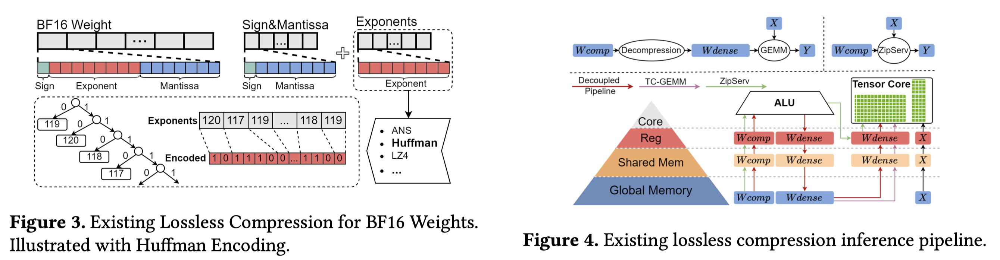

# ZipServ: Fast and Memory-Efficient LLM Inference with Hardware-Aware Lossless Compression

> Ruibo Fan, Xiangrui Yu, Xinglin Pan, Zeyu Li, Weile Luo, Qiang Wang, Wei Wang, Xiaowen Chu

## Abstract

Lossless model compression holds tremendous promise for alleviating the memory and bandwidth bottlenecks in bit-exact Large Language Model (LLM) serving. However, existing approaches often result in substantial inference slowdowns due to fundamental design mismatches with GPU architectures: at the kernel level, variable-length bitstreams produced by traditional entropy codecs break SIMT parallelism; at the system level, decoupled pipelines lead to redundant memory traffic. We present ZipServ, a lossless compression framework co-designed for efficient LLM inference. ZipServ introduces Tensor-Core-Aware Triple Bitmap Encoding (TCA-TBE), a novel fixed-length format that enables constant-time, parallel decoding, together with a fused decompression-GEMM (ZipGEMM) kernel that decompresses weights on-the-fly directly into Tensor Core registers. This "load-compressed, compute-decompressed" design eliminates intermediate buffers and maximizes compute intensity. Experiments show that ZipServ reduces the model size by up to 30%, achieves up to 2.21x kernel-level speedup over NVIDIA's cuBLAS, and expedites end-to-end inference by an average of 1.22x over vLLM. ZipServ is the first lossless compression system that provides both storage savings and substantial acceleration for LLM inference on GPUs.

---

*以下总结由 MiMo 生成：*

这篇论文旨在解决大语言模型推理中内存和带宽瓶颈问题，同时避免传统无损压缩方法带来的推理速度下降。为此，提出了ZipServ框架，其核心是张量核感知的三重位图编码（TCA-TBE）和融合解压缩-GEMM内核（ZipGEMM），实现了固定长度格式的并行解压缩与计算融合。实验表明，ZipServ能将模型大小减少高达30%，内核级速度提升达2.21倍，并使端到端推理平均加速1.22倍，首次在GPU上同时实现了存储节省和显著的推理加速。

---
kernel fusion 工作
