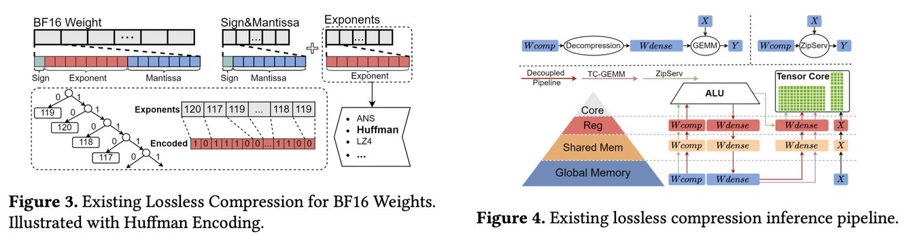

# ZipServ: Fast and Memory-Efficient LLM Inference with Hardware-Aware Lossless Compression

> Ruibo Fan, Xiangrui Yu, Xinglin Pan, Zeyu Li, Weile Luo, Qiang Wang, Wei Wang, Xiaowen Chu

## 一句话总结

ZipServ 是首个在 GPU 上同时实现 LLM 无损模型压缩存储节省与显著推理加速的框架，通过硬件感知的 TCA-TBE 编码格式和融合解压缩-GEMM 内核（ZipGEMM），将模型大小减少高达 30%、内核级速度提升达 2.21 倍、端到端推理平均加速 1.22 倍。

## 摘要翻译

无损模型压缩在缓解精确位级大语言模型（LLM）服务中的内存和带宽瓶颈方面具有巨大潜力。然而，现有方法常导致显著的推理减速，原因在于与 GPU 架构的根本设计不匹配：在内核层面，传统熵编码器产生的变长比特流破坏了 SIMT 并行性；在系统层面，解耦的流水线导致冗余的内存流量。本文提出 ZipServ，一个专为高效 LLM 推理协同设计的无损压缩框架。ZipServ 引入了张量核感知的三重位图编码（TCA-TBE），这是一种新颖的固定长度格式，支持常数时间、并行解码，以及一个融合解压缩-GEMM（ZipGEMM）内核，该内核将权重直接在运行时解压缩到张量核寄存器中。这种"加载压缩、计算解压缩"的设计消除了中间缓冲区，最大化了计算强度。实验表明，ZipServ 将模型大小减少高达 30%，内核级速度提升达 2.21 倍（相对于 NVIDIA cuBLAS），端到端推理平均加速 1.22 倍（相对于 vLLM）。ZipServ 是首个在 GPU 上同时为 LLM 推理提供存储节省和显著加速的无损压缩系统。

## 研究动机

### 核心问题
大语言模型（如 GPT-4、LLaMA-3、Qwen-3）的巨大规模使得 GPU 内存和内存带宽成为 LLM 服务的主要瓶颈。模型压缩是解决该问题的常用方案，但现有方法存在两大类问题：

1. **有损压缩的风险**：量化（如 GPTQ、AWQ）和剪枝（如 SparseGPT）等有损方法会引入精度损失。例如，激进的 4-bit 量化（MXFP4）在 LiveCodeBench 上准确率从 56.0% 降至 36.2%，而 int8 量化（GPTQ-int8）在长上下文推理中可能损失高达 11.1% 的准确率。这在安全关键和面向用户的应用中是不可接受的。

2. **无损压缩的性能开销**：虽然无损压缩可以保证位精确的模型表示，但现有无损技术在推理中会产生显著的运行时开销。如论文 Figure 1 所示，解耦的解压缩步骤本身所需时间是核心推理计算的 1.56–3.44 倍。这迫使在内存效率和运行时效率之间做出权衡。

### 根本原因
作者认为这种权衡并非根本性的，而是传统压缩算法与现代 GPU 架构之间不匹配导致的：

- **内核层面**：传统熵编码器（如 Huffman、ANS）产生变长比特流，其解码需要序列化的、数据依赖的操作。这与 GPU warp 的锁步、大规模并行 SIMT 执行模型严重冲突，导致控制流发散和计算利用不足。在 L40S GPU 上，ANS 和 Huffman 解码器分别只达到峰值内存带宽的 43.7% 和 76.5%。

- **系统层面**：大多数框架采用解耦的推理流水线，将权重完全解压到全局内存缓冲区后再传递给计算内核。这种分阶段执行导致冗余的高延迟内存访问，侵蚀了压缩带来的带宽节省，降低了推理期间的算术强度。通过 Roofline 模型分析，解耦流水线的计算强度（CI）比标准 GEMM 下降约 62%。

### 压缩可能性分析
作者对主流 LLM（Llama-3-8B、Mistral-24B、Qwen2.5-32B）的 BF16 权重进行分析，发现 8 位指数字段存在显著冗余：
- 前 3 个最频繁指数占所有权重的 67% 以上
- 前 7 个指数覆盖 95% 以上（Llama-3: 96.4%, Mistral-24B: 97.4%）
- 指数字段的信息熵仅 2.57–2.74 位，远低于 8 位分配，理论无损压缩比约 1.51×
- 在 3,875 个权重矩阵中，99.6% 的矩阵 top-7 频繁指数形成数值连续序列，这一特性可被直接利用

## 方法（技术细节）

ZipServ 包含两个核心组件：离线压缩器和在线推理引擎。

### 1. 张量核感知的三重位图编码（TCA-TBE）

TCA-TBE 是一种固定长度、基于位图的压缩格式，专门设计用于 GPU SIMT 架构和张量核操作。

#### 编码原理
- 对于每个权重矩阵，离线分析指数直方图，选择 top-7 最频繁的连续指数值
- 记录 BaseExp = min(选择范围) - 1
- 每个 8×8 的权重 tile 被编码为：
  - **三个 64 位位图（B1, B2, B3）**：每个位图编码 3 位码字的每一位
  - **高频率缓冲区（H）**：存储属于 top-7 指数范围的权重的符号和尾数（仅 8 位）
  - **回退缓冲区（L）**：存储完整精度 BF16 值（不在 top-7 范围内的权重）

#### 3 位码字选择
- 选择 3 位码字因为它在压缩率上接近最优
- 理论平均每元素存储成本为 11.3 位，接近理论下限 10.6 位（8+2.6）
- 与 2 位（12.4 位）和 4 位（12.1 位）码字相比有明显优势
- 3 位编码产生紧凑的 7 条目码本，通过简单表查找解码

#### 解耦的三重位图布局
- 不将码字打包成密集比特流，而是将 3 位码字分解为三个独立的 64 位位图
- 每个位图表示一个比特平面，保证合并内存访问（每个位图是连续的 64 位字）
- 实现无分支解码，所有 warp 线程遵循相同的执行路径

#### 层次化 Tile 设计
三层层次化 Tile 方案，按照现代 GPU 的架构粒度分区：
1. **FragTile（FT）**：8×8 基本单元，匹配张量核指令的最小操作数片段
2. **TensorCoreTile（TT）**：16×16 tile，由 2×2 的 FragTile 网格组成，对齐 PTX 级张量核 mma 指令（mma.m16n8k16）的操作数维度
3. **BlockTile（BT）**：64×64 tile，聚合多个 TensorCoreTile，由线程块协作处理

每个 8×8 FragTile 使用五个缓冲区编码：三个 64 位位图、一个 PackedSignMantissa 缓冲区、一个 FullValue 缓冲区。

### 2. 融合 ZipGEMM 内核

ZipGEMM 将解压缩和矩阵乘法融合到一个内核中，直接从全局内存中获取压缩权重，运行时实时解压到张量核寄存器。

#### 内核工作流（四阶段协调）
基于 split-K tiling 架构，每个线程块迭代处理 K 维度。在每次迭代中：
1. **Tile 加载**：线程协作加载压缩权重 tile 和激活 tile 到共享内存，使用异步和向量化的内存指令（LDGSTS.128）绕过 L1 缓存
2. **Warp 级解码**：每个 warp 独立从共享内存解压缩权重，使用轻量级 ALU 操作，避免共享内存往返
3. **激活寄存器传输**：使用 LDSM.M88 指令将激活 tile 从共享内存移动到寄存器，加载 16×16 tile 并按张量核所需布局排列
4. **张量核计算**：一旦解压后的权重和激活都在寄存器中，warp 执行张量核 mma 指令

#### 高效解压缩器设计
解压缩器在寄存器文件中实现线程局部的压缩权重重建：

1. **空间位图指示器（Spatial Bitmap Indicator）**
   - 三个位图通过 warp 级按位 OR 生成单个 64 位指示掩码
   - 每位指定一个元素的存储模式：1 为压缩，0 为回退
   - 每个线程通过检查其对应位（位置 2i 和 2i+1）确定解码路径

2. **动态寻址（Dynamic Addressing）**
   - 通过 warp 局部的前缀和计算读取偏移量
   - 使用 __popc() 和 __shfl_sync() 等 GPU 原生指令高效计算
   - 将索引转换为确定性、SIMT 友好的操作

3. **快速指数重组（Fast Exponent Reassembly via Implicit Lookup）**
   - 使用基于算术重映射的隐式查找机制，避免基于表的解码
   - 运行时每个线程通过将 3 位码字加到基指数上重建原始指数
   - 使用单个整数 ALU 指令消除共享内存表查找

#### 细粒度软件流水线
ZipGEMM 使用两级分层流水线：
- **粗粒度**：tile 级双缓冲，重叠全局到共享内存的传输与计算
- **细粒度**：slice 级交织，重叠共享到寄存器的移动和解压缩与张量核操作

通过分层屏障策略协调两级流水线，使用 cp.async.wait_group<0>() 和 __syncthreads() 确保异步传输完成。

### 3. 阶段感知的推理策略

ZipServ 对不同推理阶段采用不同策略：
- **Decode 阶段**（内存密集，小 N）：使用融合 ZipGEMM 内核，实现"加载压缩、计算解压缩"
- **Prefill 阶段**（计算密集，大 N）：退回到解耦流水线，先用高效解压缩内核将权重解压到全局内存，再执行高吞吐量 GEMM，解压开销 <4%

两个阶段共享相同的压缩格式和线程局部解压缩逻辑，无需运行时格式转换。

### 4. 实现

- 大约 3,500 行代码
- 核心引擎约 2,500 行 CUDA 和 C++，实现离线 TCA-TBE 压缩器和在线 ZipGEMM 内核
- 编译为独立共享库（.so），使用 PyBind11 集成到 vLLM
- 约 1,000 行 Python 胶水代码

## 实验结果

### 评估平台
1. 消费级服务器：4× NVIDIA RTX4090（24GB，Compute Capability 8.9）
2. 数据中心平台：4× NVIDIA L40S（48GB）
3. 最新 RTX5090（Blackwell，32GB，Compute Capability 12.0）用于前向兼容测试

### 基线方法
- cuBLAS_TC v12.4.5（NVIDIA 官方 BF16 张量核 GEMM 内核）
- DietGPU（GPU 原生 rANS 编解码器）
- nvCOMP（NVIDIA 通用 rANS 解压库）
- DFloat11（基于 Huffman 的 GPU 解压框架）

### ZipGEMM 内核性能
- **RTX4090**：平均加速 1.31×，峰值 1.71×（相对 cuBLAS_TC）
- **L40S**：平均加速 1.36×，峰值 2.21×（相对 cuBLAS_TC）
- **其他方法**：DietGPU（0.17×/0.20×）、nvCOMP（0.19×/0.23×）、DFloat11（0.28×/0.34×）——均严重减速
- **RTX5090**：LLaMA3.1-8B 1.34×，Mistral-24B 1.87×
- **消费级 vs 数据中心**：RTX4090 + ZipGEMM 超过 A100 cuBLAS_TC（LLaMA3.1-8B 快 9.3%），仅慢 2.7%（Mistral-24B）
- **层分析**：GateUp_proj（1.39×）和 Down_proj（1.64×）加速显著；小形状层（如 O_proj）可能减速（0.79×）
- **微分析**：DRAM 读取减少 29.3%，Tensor Core 利用率保持 cuBLAS 基线的 71.6%，共享内存 bank 冲突几乎消除

### 独立解压内核性能
- ZipServ-Decomp 相对 DietGPU（2.14×）、nvCOMP（1.83×）、DFloat11（1.10×）

### 端到端推理性能
- **延迟**：相对 vLLM 减少 17.60%，相对 Transformers 减少 60.79%，相对 DFloat11 减少 82.13%
- **吞吐量**：相对 vLLM 平均 1.22×，相对 Transformers 3.18×，相对 DFloat11 8.52×
- **长上下文**：生成 2048 输出 token（batch size 32，LLaMA3.1-8B），吞吐量 1105 tokens/sec，相对 vLLM 1.66×
- **内存节省**：LLaMA3.1-8B（14.96 GB → 10.83 GB，72.4%），Mistral-24B（43.92 GB → 31.30 GB，71.3%），LLaMA3.1-70B（131.56 GB → 93.52 GB，71.1%）

### 内存与延迟分解分析（LLaMA3.1-8B，RTX4090）
- 基线 vLLM（序列长度 1024）：GEMM 操作占 24.99 ms（83.6% 总延迟）
- ZipServ：线性层延迟降至 14.76 ms（1.69× 改进）
- KV 缓存容量从 5.07 GB 扩展到 8.60 GB（1.70× 增加）

### 开销分析
- **运行时开销**：decode 阶段无开销；prefill 阶段（N=8192）仅约 4% 开销
- **离线压缩成本**：LLaMA3.1-8B 约 2.5 分钟（16 核 Intel Xeon 8352V CPU），一次性操作

## 优势

1. **首次实现存储节省与推理加速的统一**：首个无损压缩系统在 GPU 上同时提供存储节省和显著推理加速，无需牺牲精度
2. **硬件感知的压缩格式**：TCA-TBE 专为 GPU SIMT 架构和张量核设计，避免变长编码的控制流发散
3. **融合解压-计算**：ZipGEMM 将解压缩和 GEMM 融合，消除中间缓冲区，最大化计算强度
4. **位精确、无精度损失**：保证与原始模型完全一致的数值结果，适用于安全关键场景
5. **多代 GPU 兼容**：在 RTX4090、L40S、RTX5090 等多代 GPU 上表现良好
6. **缩小消费级与数据中心 GPU 差距**：RTX4090 + ZipGEMM 可接近甚至超越 A100 的性能
7. **与有损方法正交**：可应用于量化权重之上，进一步利用残余冗余
8. **实现简洁**：约 3.5K 行代码，易于集成到 vLLM 等推理框架
9. **低离线开销**：模型压缩仅需几分钟，不影响在线服务
10. **内存节省转化为吞吐量增益**：释放的内存可被 KV 缓存使用，支持更大批量和更长上下文

## 局限

1. **数据中心 GPU 上优势有限**：在高带宽的 A100/H800 上，ZipGEMM 可能无法匹配高度优化的 cuBLAS 基线，因为充足的 HBM 带宽缓解了 ZipServ 要解决的内存瓶颈，而较低的核心频率使密集 ALU 工作负载更难被软件流水线隐藏
2. **小形状层性能可能下降**：如 O_proj 层（LLaMA3.1-8B 在 L40S 上为 0.79×），需要细粒度参数调优（如 split-K 配置和精确 tiling）
3. **目前仅针对 NVIDIA GPU 优化**：虽然核心设计具有硬件无关性，但当前实现仅针对 NVIDIA 架构
4. **压缩率受限**：由于使用 3 位编码和回退机制，压缩率上限约为 30%，不如有损量化方法（如 4-bit 量化）
5. **有损方法在延迟上仍可能更快**：ZipGEMM 相比 Marlin W8A16 FP8（0.194 ms vs. 0.143 ms）仍有 1.36× 差距，这与有效位宽的比率一致
6. **Prefill 阶段仍需解耦**：大 N 场景下仍使用解耦流水线，未能实现完全融合

## 与 EfficientPaper 相关的研究方向

1. **无损模型压缩与推理加速**：ZipServ 展示了无损压缩不仅可以节省存储，还能加速推理，这一方向对于需要位精确的应用（如安全关键系统、模型验证）具有重要意义
2. **Kernel Fusion 与硬件协同设计**：ZipGEMM 将解压缩和 GEMM 融合的思想可推广到其他操作（如 KV 缓存压缩、注意力计算），对 EfficientPaper 中 kernel fusion 类工作有参考价值
3. **内存效率与推理性能的协同优化**：ZipServ 通过压缩静态权重释放内存给 KV 缓存，实现了内存效率和推理吞吐量的协同提升，与 EfficientPaper 中的系统级优化方向一致
4. **多代 GPU 兼容性**：ZipServ 在消费级和数据中心 GPU 之间的性能差距缩小，对 EfficientPaper 中关注的硬件兼容性和部署灵活性有启示
5. **有损与无损方法的结合**：ZipServ 与量化方法正交，可叠加使用，为 EfficientPaper 中的模型压缩和推理优化研究提供了新的组合方向
6. **KV Cache 压缩**：论文指出 TCA-TBE 可适配无损 KV Cache 压缩，这对 EfficientPaper 中关注的长上下文推理效率有直接关联
7. **分布式训练通信压缩**：ZipServ 的压缩技术可应用于分布式训练中的梯度通信压缩，与 EfficientPaper 中的分布式效率方向相关

---

*本笔记由 AI Agent（Hermes Agent）自动生成，基于论文全文阅读和分析。生成时间：2026年6月。*
