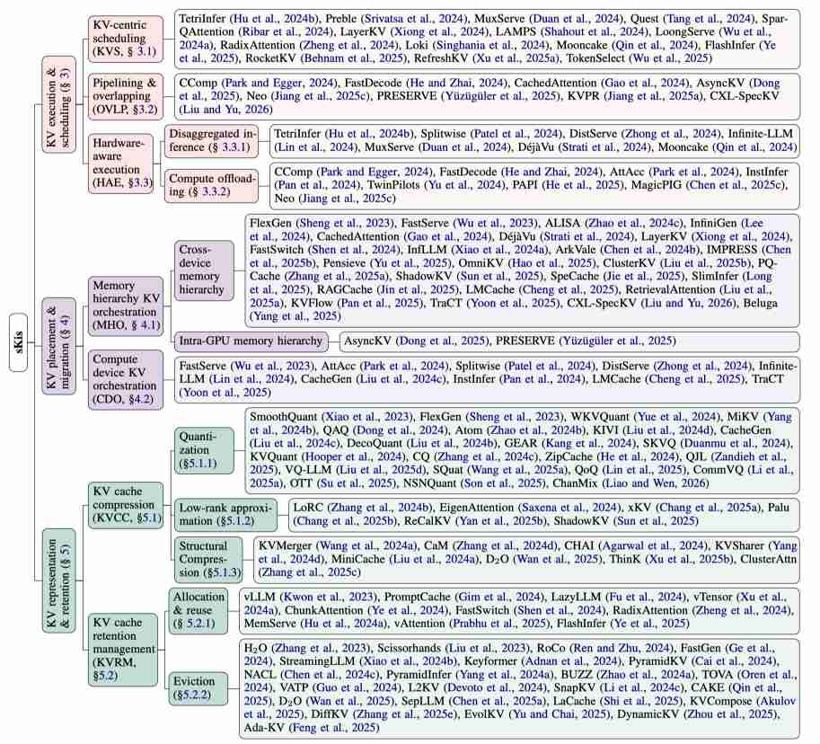

# Towards Efficient LLM Serving: A Survey on System-Aware KV Cache Optimization

## 核心思想

首篇以 **系统行为**（而非生命周期阶段或优化层）组织 KV Cache 优化的综述。提出 sKis（system-aware KV infrastructure for serving LLMs）框架，将 ~100+ 篇论文归类为三个维度：

- **时间维度（Execution & Scheduling）**：KV 数据何时被访问/计算/调度
- **空间维度（Placement & Migration）**：KV 数据放置在哪个内存层级/设备
- **结构维度（Representation & Retention）**：KV 数据如何压缩/管理

## 创新点

1. **行为导向分类法（Behavior-Oriented Taxonomy）**
   - 七个子行为：KVS（KV-centric scheduling）、OVLP（pipelining/overlapping）、HAE（hardware-aware execution）、MHO（cross-device memory hierarchy）、CDO（cross-compute device）、KVCC（representation/compression）、KVRM（retention management）
   - 解耦于模型和 kernel 细节，为新技术提供稳定的定位框架

2. **跨行为协同设计亲和度分析（Co-Design Affinity Matrix）**
   - 用 Tanimoto 系数量化七个行为间的共现强度
   - 发现 HAE-CDO 是最强协同模式（0.42），但大多论文只优化单一行为
   - 识别出被忽视的协同机会（如 KVS-KVRM、MHO-KVCC）

3. **六大开放挑战（C1-C6）**
   - C1: SLO 尾延迟控制（大多系统缺失 tail metrics）
   - C2: 能耗感知优化（energy 仍很少被报告/优化）
   - C3: 可信高效 sKis（KV eviction 可能损害鲁棒性/隐私/安全）
   - C4: 通用 HAE-CDO 模式（跨 NVLink/CXL/PCIe 可移植）
   - C5: 联合优化与中间语义（eviction/offload/prefetch 联合决策）
   - C6: 统一基准（缺乏标准化 metrics 和 stress workloads）

## 带来的提升

1. **KV Cache 优化全景图**：为快速演进的领域提供系统性定位框架，新方法可快速找到自己的位置（空间/时间/结构 × 目标）
2. **协同设计洞察**：量化了行为间的耦合强度，揭示当前研究的盲区（大多只优化单一行为，错失协同收益）
3. **研究方向指引**：六个挑战直接指向 next wave 的研究机会，特别是 SLO-aware tail control、energy-aware sKis、trust-aware eviction policy

## 与 EfficientPaper 的关联

该综述与 EfficientPaper 的方向 1（KV Cache 管理）高度相关，提供了最全面的方法分类和协同设计分析。其中提到的许多方法（如 Mooncake、PersistentKV、KVpop、DeltaKV 等）已收录在 EfficientPaper 中。

## 关键数据

- 涵盖论文：100+ 篇 sKis 相关工作
- 分类维度：7 个子行为 × 3 大维度
- 协同分析：Tanimoto 系数阈值 θ=0.14
- 来源机构：University of Melbourne（通讯作者）、Huazhong University of Science and Technology
- 27 页，含详细附录（co-design affinity、trustworthy sKis、intermediate semantics 讨论）
